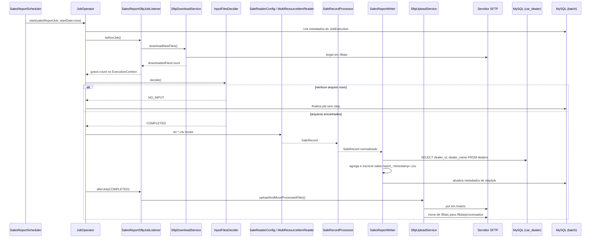

---
# car-dealer

Este projeto é uma implementação prática de processamento de grandes lotes de dados utilizando **Spring Batch**, focada na leitura, normalização e consolidação de relatórios de vendas em formato CSV.

Diferente de implementações básicas, este projeto utiliza uma arquitetura robusta que inclui:

* **Docker Compose**: Gerenciamento de serviços auxiliares (Banco de Dados e SFTP).
* **MySQL**: Armazenamento segregado de metadados do Spring Batch e dados de negócio na porta **3307**.
* **Servidor SFTP**: Fluxo real de transferência de arquivos entre filiais e matriz.

## Caso de Uso

A aplicação simula o ecossistema de uma rede de concessionárias. As filiais depositam arquivos de vendas em um servidor SFTP; a aplicação realiza o download, processa os dados em lote (normalizando registros e consultando a base de dados de vendedores), gera um relatório consolidado da matriz e devolve o resultado ao SFTP, movendo os arquivos originais para uma pasta de processados.

---

## Fluxo de Execução

1. **Agendamento**: `SalesReportScheduler` dispara o job em intervalos fixos.
2. **Integração**: `SalesReportSftpJobListener` inicia o download de novos arquivos via `SftpDownloadService`.
3. **Decisão**: `InputFilesDecider` avalia se há arquivos para processar ou encerra como `NO_INPUT`.
4. **Leitura**: `SaleReaderConfig` utiliza `MultiResourceItemReader` para ler todos os CSVs locais.
5. **Processamento**: `SaleRecordProcessor` aplica as regras de negócio e normalização.
6. **Escrita**: `SalesReportWriter` agrega dados, valida contra a tabela `dealers` no MySQL e gera o CSV da matriz.
7. **Finalização**: `SftpUploadService` envia o relatório final ao SFTP e limpa o diretório de entrada.

---

## Diagrama de Sequência (Mermaid)



---

## Como Executar o Projeto

### Pré-requisitos

* **Java 21**.
* **Docker Desktop** ativo com suporte a Docker Compose.

### 1. Subindo a Infraestrutura

Na raiz do projeto, inicie os serviços de banco de dados e SFTP:

```bash
docker compose -f docker/docker-compose.yml up -d

```

* **MySQL**: `localhost:3307` (Bancos: `car_dealer` e `batch`).
* **SFTP**: `localhost:2222` (User: `batch`).

### 2. Preparando Dados de Teste

Simule o envio de arquivos das filiais copiando os CSVs de exemplo para o volume do SFTP.

**PowerShell (Windows):**

```powershell
Copy-Item -Path .\src\main\resources\filial-report\*.csv -Destination .\docker\data\aurora\filiais\ -Force

```

**Bash (Linux/Mac):**

```bash
cp -f src/main/resources/filial-report/*.csv docker/data/aurora/filiais/

```

### 3. Rodando a Aplicação

Execute o comando Maven:

```bash
mvn spring-boot:run

```

* **Scheduler**: O Job checará novos arquivos a cada 5 segundos (`@Scheduled(fixedRate = 5000)`).
* **Resultados**: O relatório consolidado será gerado na pasta local `${user.home}/car-dealer-data/matriz-report` e enviado para o diretório `/matriz` no SFTP.

---

## Acesso aos Bancos de Dados

Utilize qualquer cliente SQL (DBeaver, MySQL Workbench) com as credenciais:

* **Host**: `localhost` | **Porta**: `3307`
* **User**: `admin` | **Senha**: `admin123`

**Consulta de Negócio:**

```sql
SELECT * FROM car_dealer.dealers;

```

**Consulta de Auditoria Batch:**

```sql
SELECT JOB_EXECUTION_ID, STATUS, EXIT_MESSAGE, CREATE_TIME 
FROM batch.BATCH_JOB_EXECUTION 
ORDER BY CREATE_TIME DESC LIMIT 10;

```

---
